## Fluxo da Solução - Cadastro de Ficha Escolar
 

1. Acessar a home: http://localhost:8080.
2. A tela da Home será apresentada:
 

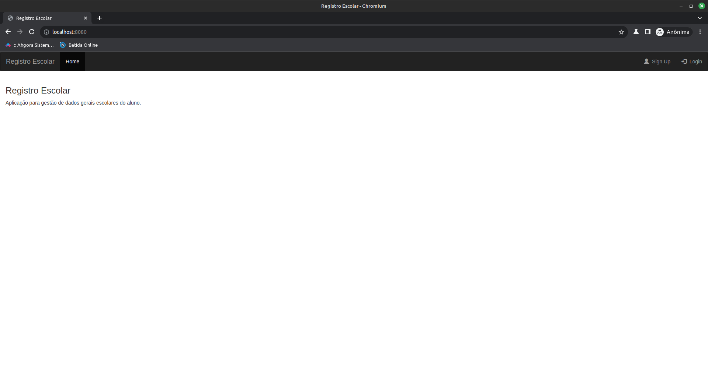

3. Realize o Sign-up e o Login.
 

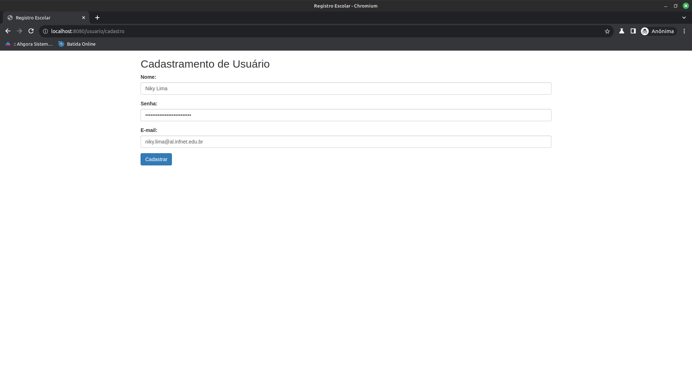

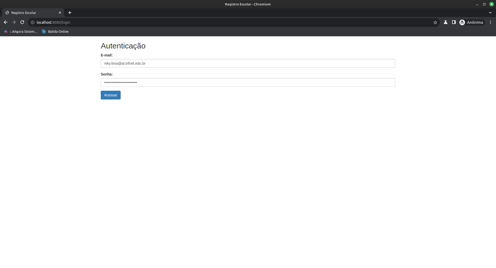

4. Cada aba do menu possui 2 sub-abas: Cadastro e Listagem:
 

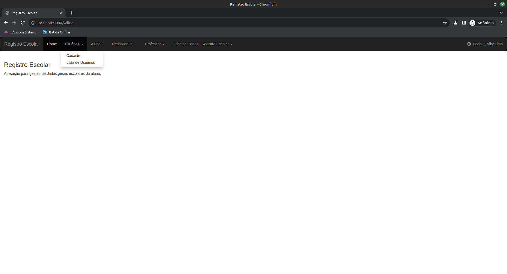

4. Realize os cadastros na sequência:
**Aluno > Responsável > Professor > Efetivação da Ficha de Cadastro.**
 

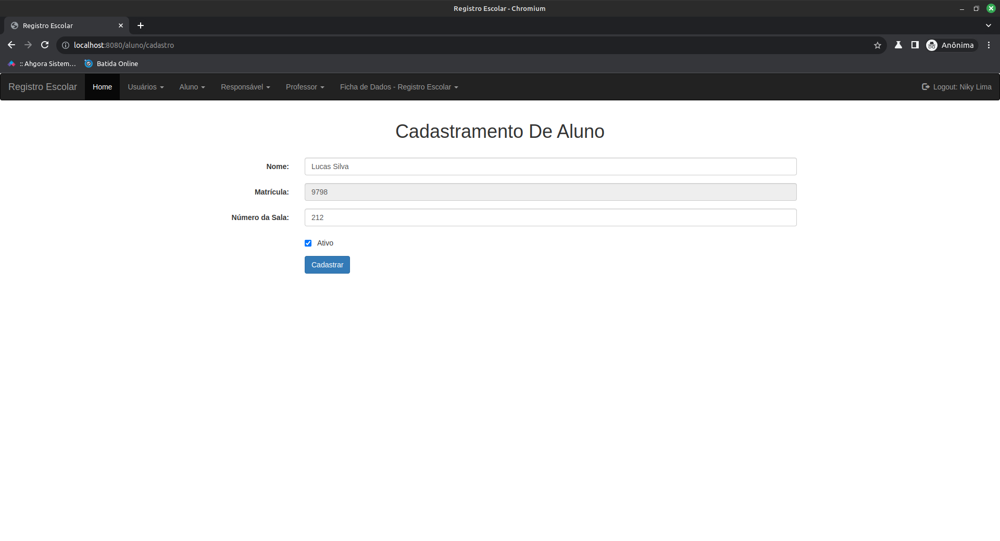

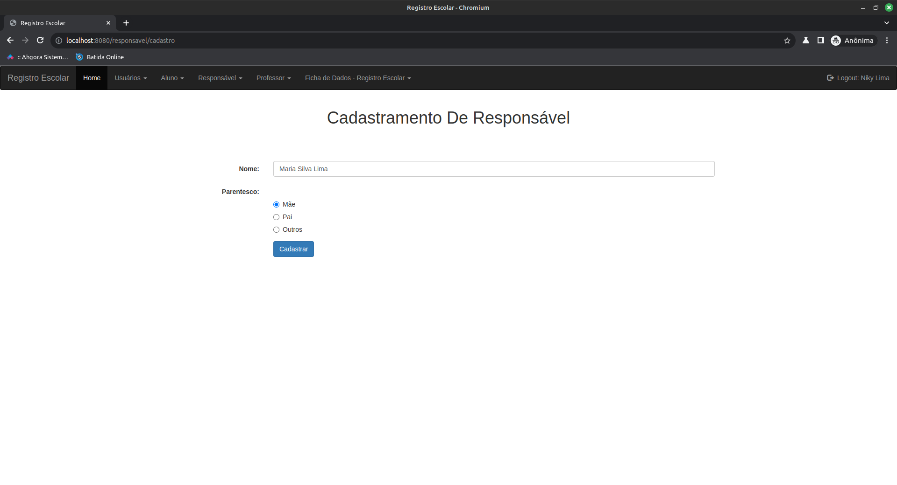

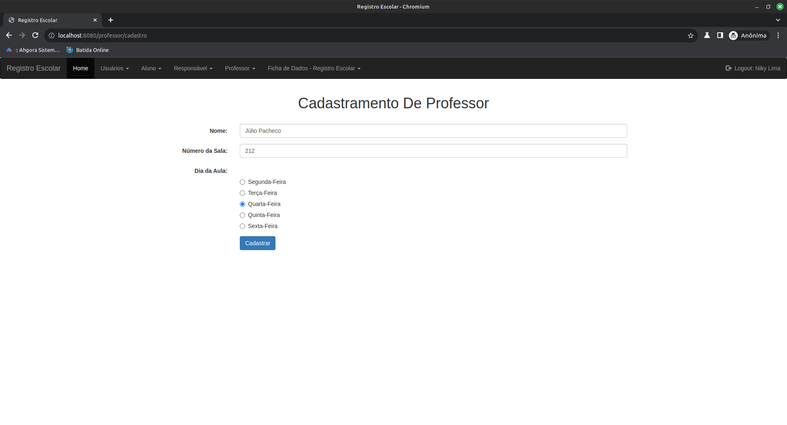

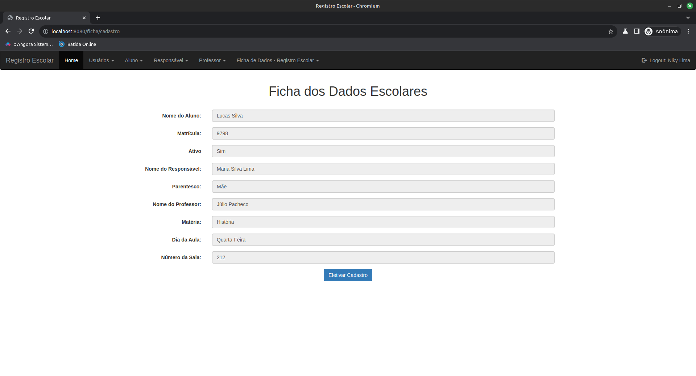

5. Após todo o processo, a Lista de Cadastramento - Ficha de Dados Efetivada será apresentada.
 

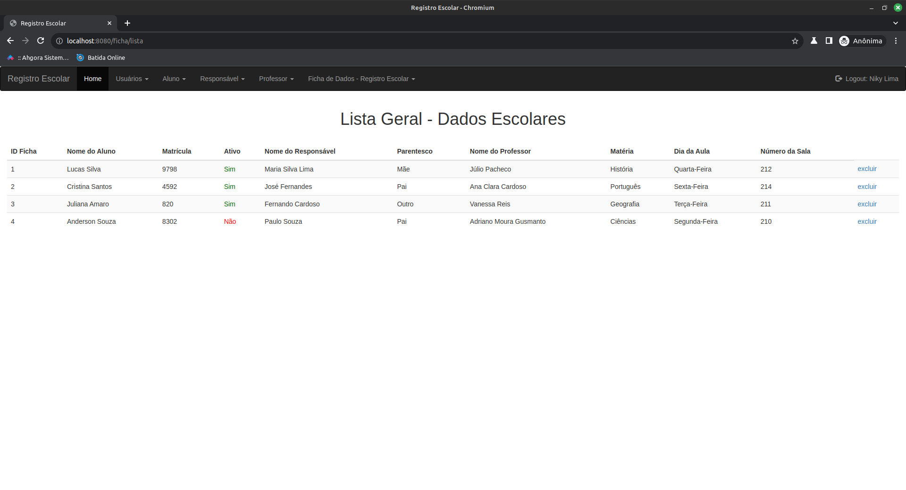

6. Tratamento de exceção:
- Caso seja inserida uma sala diferente do Enum declarado dentro do projeto, a seguinte tela será apresentada:
 

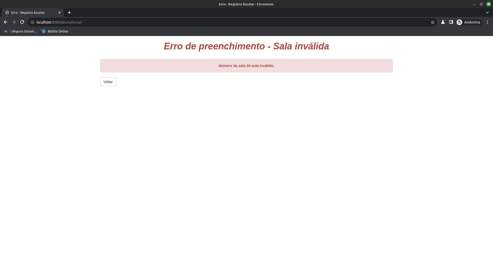

7. Clicando no canto superior esquerdo, Registro Escolar, será apresentado detalhes sobre as classes como ensinado em aula.
 

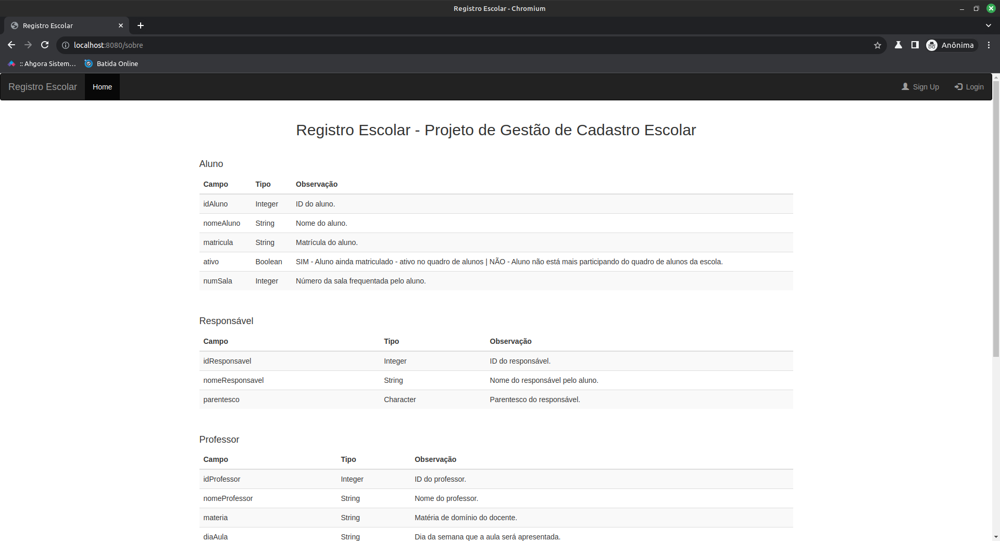

8. 
<< IMPORTANTE >>

**Para a exclusão dos dados, a sequência para não quebrar as regras de foreign key deve ser:**

**Excluir: Ficha Escolar > Responsável > Professor > Aluno.**

🔙 [Voltar ao repositório](https://github.com/npalleta/Infnet-Dep-Inj-Project)

---